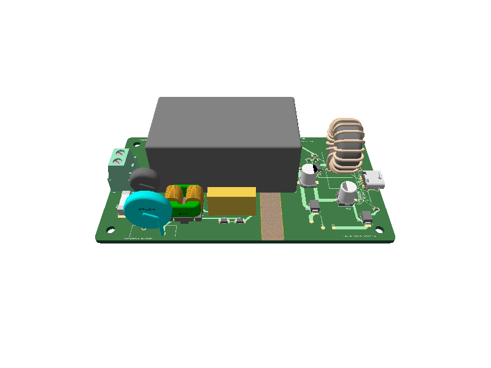

# USB-C PD 18 W AC Wall Charger

This repository contains the electrical and PCB design for an isolated AC-mains to USB-C Power Delivery charger. Written in tscircuit, the design accepts a nominal 100–240 VAC input and supports three negotiated output profiles: 5 V / 3 A, 9 V / 2 A, and 12 V / 1.5 A, up to 18 W.

The design combines mains protection, EMI filtering, an encapsulated AC/DC module, a USB-PD buck stage, secondary-side transient protection, PCB layout, and a mechanical fit-check enclosure in one TypeScript project.



## At a glance

| Item | Specification |
| --- | --- |
| Product input rating | 100–240 VAC, 50/60 Hz |
| AC/DC module operating range | 85–265 VAC |
| USB-C output profiles | 5 V / 3 A, 9 V / 2 A, 12 V / 1.5 A |
| Maximum USB output | 18 W |
| Isolated supply | HLK-20M15C, 15 V / 1.333 A |
| USB-PD buck SoC | Standard Injoinic IP6520 (non-PPS) |
| PCB | 110 × 60 mm, 2-layer, 1.6 mm FR-4 |
| Isolation layout | 8 mm primary-to-SELV all-layer copper keepout |
| Enclosure model | 116 × 66 × 42 mm fit-check shell |
| Firmware | None; the selected IP6520 handles PD negotiation and output selection autonomously |

This implementation uses the standard `IP6520` (`C7433861`) non-PPS variant and is not a USB-C input/sink design. Other IP6520 family variants provide different output profiles and are not approved BOM substitutions.

## Power architecture

```text
AC line / neutral
  │
  ├─ F1      2 A time-delay fuse
  ├─ RV1     300 VAC MOV surge clamp
  ├─ TH1     5 Ω NTC inrush limiter
  ├─ LCM1    two-line common-mode choke
  ├─ C7      305 VAC X2 capacitor with R3/R4 bleeders
  │
  └─ U1      HLK-20M15C isolated 15 V AC/DC module
       │
       ├─ D1 15 V rail TVS
       │
       └─ U2 IP6520 synchronous buck + USB-PD source
            ├─ L1/C4/C5 output power stage
            ├─ D2 USB VBUS TVS
            ├─ D3–D6 CC and USB 2.0 ESD protection
            │
            └─ J2 USB-C output
                 ├─ 5 V / 3 A
                 ├─ 9 V / 2 A
                 └─ 12 V / 1.5 A
```

### Mains input and filtering

The AC input enters through `J1`. The line conductor is protected by a time-delay fuse, MOV, and NTC before passing through the common-mode choke. A safety-rated X2 capacitor filters line-to-neutral noise, while two series bleeder resistors discharge it after disconnection.

The filtered mains input feeds the encapsulated `HLK-20M15C`. Using a bought-out isolated module keeps the carrier board focused on input protection, physical separation, and the low-voltage USB-PD stage instead of implementing a custom offline flyback converter.

### Isolated USB-PD output

The module's isolated 15 V output is locally bypassed and protected by `D1`. The `IP6520` then performs synchronous buck conversion and USB-PD source negotiation. Its switch node drives a 22 µH inductor, output capacitors, and the USB-C VBUS rail.

The USB side includes a dedicated VBUS TVS, individual low-capacitance clamps for CC1, CC2, D+, and D−, and test points for 15 V, ground, and VBUS measurements.

### Power and validation margin

The `HLK-20M15C` is nominally rated for 15 V at 1.333 A. Buck-conversion losses leave little electrical and thermal headroom while delivering the full 18 W USB output. Full-load efficiency, input-current, regulation, and temperature-rise testing in the final closed enclosure are mandatory before retaining the 18 W rating.

The IP6520 input range includes 15 V, but the datasheet's 12 V / 1.5 A electrical-characteristic point is specified with a 24 V input. The exact 15 V input to 12 V / 1.5 A output condition therefore remains a hardware-validation point. If the board cannot sustain it across mains, load, temperature, and transient limits, the 12 V PDO must be removed/derated or the power architecture revised.

## PCB and mechanical design

- Primary-side AC parts are grouped on the left; the isolated USB-PD stage is on the right.
- An 8 mm copper-free corridor spans both copper layers between the primary and SELV regions.
- The ground pour is restricted to the isolated low-voltage side.
- Routed trace widths and via dimensions are recorded in the fabrication geometry report.
- Four 3.2 mm non-plated mounting holes provide fixed enclosure mounting points.
- The USB-C receptacle and mains entry include enclosure aperture definitions.
- The included FDM enclosure is a volume and connector-alignment model, not a production housing.

PCB and schematic snapshots are available in [`__snapshots__/`](__snapshots__). The standalone enclosure fit-check model is in [`mechanical/enclosure-fit-check.scad`](mechanical/enclosure-fit-check.scad).

## Key components

| Ref | Part | Function | JLCPCB/LCSC |
| --- | --- | --- | --- |
| J1 | WJ500V-5.08-2P | AC line/neutral termination | C8465 |
| F1 | SCT1032T2A250V | 2 A / 250 V time-delay fuse | C19712562 |
| RV1 | Bourns MOV-14D471K | 300 VAC surge suppression | C1527439 |
| TH1 | MF72 5D9 | 5 Ω / 3 A inrush limiter | C11277 |
| LCM1 | XRSQ1010-10mH-H | 10 mH two-line common-mode choke | C5380257 |
| C7 | TDK B32922C3104M189 | 100 nF / 305 VAC class-X2 capacitor | C125429 |
| R3, R4 | 1206W4F1004T5E | Series X-capacitor bleeders | C17927 |
| U1 | Hi-Link HLK-20M15C | Isolated 15 V / 1.333 A AC/DC module | C52746093 |
| D1 | SMBJ15A | 15 V rail TVS | C83846 |
| U2 | Injoinic IP6520 | Synchronous buck + USB-PD source SoC; standard non-PPS variant | C7433861 |
| L1 | PDMTAT068125-220MLU | 22 µH buck inductor | C3011539 |
| D2 | SMBJ13A | USB VBUS TVS | C19077567 |
| D3–D6 | PESD5V0H1BSF | CC and USB 2.0 ESD protection | C477989 |
| J2 | TYPE-C-31-M-12 | USB-C receptacle | C165948 |

The supplier IDs are included for design reproducibility, not as an approval of substitutions or a guarantee of stock. Verify the exact manufacturer, rating, footprint, and safety documentation before assembly. In particular, confirm that U2 is marked and ordered as the standard `IP6520`; do not substitute another family variant without requalifying the USB-PD profiles and power budget.

## Repository structure

```text
.
├── index.circuit.tsx              Main tscircuit source and board layout
├── index.circuit.circuit.json     Generated circuit consumed by viewers/tools
├── imports/                       Custom component and footprint definitions
├── firmware/                      Autonomous-controller profile and host PDO checker
├── fabrication/                   BOM, CPL, Gerbers, pin map, drawings and check records
├── scripts/                       Reproducible export and fabrication-integrity checks
├── .github/workflows/             Independent GitHub circuit CI
├── BOM.csv                        Generated complete purchased electrical BOM
├── __snapshots__/                 Schematic, PCB, and 3D reference renders
├── mechanical/                    Enclosure fit-check source
├── FABRICATION_NOTES.md            Board construction and CAM review notes
├── FIRMWARE_BRINGUP.md             Controller/board bring-up; no flashing required
├── PINMAP.md                      Important interfaces and full generated pin-map link
├── POWER_BUDGET.md                Calculated conversion and module headroom
├── JLCPCB_PARTS.md                 Procurement and assembly-list guidance
├── PACKAGE_AUDIT.md                Package and supplier orientation review scope
├── DESIGN_REVIEW.md                Review index and open findings
├── VALIDATION.md                   Reproduction commands and check scope
├── DRC_REPORT.md                   CAD findings and retained-log index
├── COMPLIANCE_PLAN.md             Certification planning and evidence gaps
├── LAB_VALIDATION_PLAN.md         Hardware test plan
├── ENCLOSURE_REQUIREMENTS.md      Production enclosure requirements
└── DESIGN_RISK_REGISTER.md        Known risks and release gates
```

## Getting started

The project uses [Bun](https://bun.sh/) and the tscircuit CLI included in the development dependencies.

```sh
git clone https://github.com/techmannih/usbc-charger.git
cd usbc-charger
bun install
bun run dev
```

`bun run dev` opens the interactive tscircuit development viewer. The default circuit entrypoint is [`index.circuit.tsx`](index.circuit.tsx).

## Commands

| Command | Purpose |
| --- | --- |
| `bun run dev` | Start the interactive local viewer |
| `bun run typecheck` | Check the TypeScript source |
| `bun run check:netlist` | Check declared circuit connections |
| `bun run build` | Build `dist/index/circuit.json` with routing and the parts engine disabled |
| `bun run build:placement` | Alias for the default placement build |
| `bun run build:routed` | Build with full routing, bypassing the placement config; 5-minute timeout per autorouter phase |
| `bun run verify` | Run type, netlist, schematic placement, PCB placement, shorts, and build checks |
| `bun run build:preview` | Generate PCB, schematic, and 3D preview images |
| `bun run snapshot:update` | Update committed PCB, schematic, and 3D snapshots |
| `bun run snapshot:3d:update` | Update the committed angled 3D snapshot |
| `bun run build:handoff` | Generate KiCad, STEP, and GLB handoff outputs |
| `bun run export:fabrication` | Fresh build, check records, BOM/CPL/pinmap, both schematic sheets and gated Gerber export |
| `bun run check:fabrication` | Verify generated artifacts, BOM/placement coverage, archive contents and source hashes |
| `bun run check:pdos <capture.json>` | Compare decoded analyzer PDOs with the design targets; no device flashing |

Generated export files are written under `dist/index/`.

`tscircuit.config.json` disables routing for the default build, including hosted
builds that read this config. Use `bun run build:routed` for routed output.
CI, `verify`, handoff builds, and fabrication exports explicitly enable routing.

The dedicated fabrication workflow writes a versioned review package under
[`fabrication/`](fabrication/README.md), plus the root [`BOM.csv`](BOM.csv).
It requires Bun and `zip`/`unzip`. Its source inventory and file hashes prevent
accidental mixing of revisions. See
[`REFERENCE_COMPARISON.md`](fabrication/REFERENCE_COMPARISON.md) for the file-category
mapping to the three linked pedometer projects.

The controller needs no external application firmware. The new
[`firmware/`](firmware/README.md) folder records the expected fixed PDOs and
contains a host-side capture checker. It cannot change U2's behavior.

## Development workflow

Use a topic branch and open a pull request into `main`, with a descriptive
commit/PR title such as `ci: add circuit build checks`. The
[`Circuit CI`](.github/workflows/circuit-ci.yml) workflow runs on pull requests
into `main`, pushes to `main`, and manual dispatches. It provides three checks:
`Typecheck`, `Netlist`, and `Build`. Build waits for both other checks, verifies
the committed fabrication package, compiles the circuit, then checks the fresh
routed output for copper shorts. Build outputs and any short-check diagnostics
are retained as a workflow artifact for seven days.

CI uses Bun 1.3.14 from `packageManager`, SHA-pinned actions, a frozen lockfile,
and read-only repository permissions. It does not publish to tscircuit, push
commits, or approve manufacturing. Existing placement-review findings remain
documented in [`DRC_REPORT.md`](DRC_REPORT.md); this workflow is not the full
`bun run verify` release gate. To enforce checks before merge, configure the
three check names as required in GitHub branch rules after their first run.

The package version is `1.0.9` to try bypassing the suspected hosted `1.0.8`
release-version collision. The hosted retry still needs a push to `main` (or a
PR merge) and must be checked separately in tscircuit releases. A passing
`Circuit CI` result does not prove that hosted publishing succeeded.

Regenerate `bun run export:fabrication` and run `bun run check:fabrication`
after changing files covered by the fabrication manifest, including
`package.json`, documentation, or export scripts; commit the refreshed outputs
with those changes.

After changing the circuit source or a component definition:

```sh
bun run verify
bun run snapshot:update
bun run snapshot:3d:update
git diff -- index.circuit.circuit.json __snapshots__
```

Commit `index.circuit.circuit.json` whenever the TSX circuit changes. Hosted viewers and downstream tools can consume this generated file; leaving it stale can make a deployed board differ from the local `tsci dev` render.

Before opening a hardware or manufacturing handoff, inspect the schematic, PCB, 3D assembly, generated circuit JSON, and check outputs together.

## Design status

The repository contains the CAD source and engineering workflow for a hardware prototype. It is not a validated or certified consumer product. Automated CAD checks establish source consistency; they do not prove electrical safety, EMC performance, thermal margin, enclosure safety, or USB-IF compliance.

The remaining physical work includes:

- prototype assembly and incoming-part verification;
- USB-PD protocol and load testing across every supported PDO;
- efficiency, ripple, thermal-rise, and abnormal-condition testing;
- surge, EFT, ESD, conducted/radiated emissions, and immunity testing;
- creepage, clearance, dielectric-strength, leakage, and accessible-part evaluation;
- validation inside the final flame-retardant enclosure with the production cord and strain relief.

See the project handoff documents for detailed requirements:

- [`COMPLIANCE_PLAN.md`](COMPLIANCE_PLAN.md)
- [`LAB_VALIDATION_PLAN.md`](LAB_VALIDATION_PLAN.md)
- [`ENCLOSURE_REQUIREMENTS.md`](ENCLOSURE_REQUIREMENTS.md)
- [`DESIGN_RISK_REGISTER.md`](DESIGN_RISK_REGISTER.md)

## Safety notice

This board contains hazardous mains voltage. Do not energize an exposed PCB, connect it to a phone, or treat the fit-check enclosure as a finished product. Mains testing and enclosure review must be performed with appropriate equipment by qualified personnel.

The final product requires verified safety-critical parts, a rated cable and plug, independent strain relief, inaccessible live parts, preserved creepage and clearance, a suitable flame-retardant enclosure, and approval under the standards applicable to the target market.

## Design references

- [Hi-Link HLK-20M15C product page](https://www.hlktech.net/index.php?cateid=734&id=128)
- [Injoinic IP6520 datasheet](https://www.injoinic.com/api/static/uploads/20250529/20250529105252_6837cc049d55b.pdf)
- [TDK B32922C3104M189 X2 capacitor](https://product.tdk.com/en/search/capacitor/film/emi-suppression/info?part_no=B32922C3104M189)
- [Bourns MOV-14D series datasheet](https://www.bourns.com/docs/Product-Datasheets/MOV14D.pdf)
- [USB-IF USB Type-C and USB Power Delivery](https://www.usb.org/usbc)
- [USB-IF compliance program](https://www.usb.org/compliance)
- [BIS products under compulsory registration](https://www.bis.gov.in/product-certification/products-under-compulsory-certification/scheme-ii-registration-scheme/)
